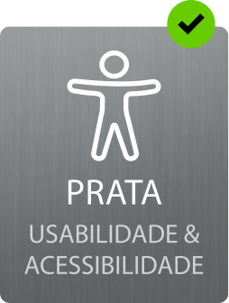
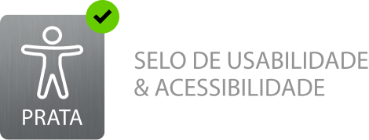
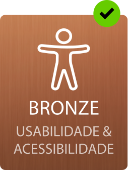

# Selo de Usabilidade e Acessibilidade

**Nota prévia: caso encontre algum problema com o presente documento que nos queira reportar, use, por favor, o endereço de correio eletrónico: <a href="mailto:acessibilidade@ama.gov.pt">acessibilidade@ama.gov.pt</a>**.

## Índice 

- [Introdução](#introdução)
- [Processo de Candidatura](#processo-de-candidatura)
- [Níveis de Classificação](#níveis-de-classificação)
- [Requisitos do Selo Bronze](#requisitos-do-selo-bronze)
- [Requisitos do Selo Prata](#requisitos-do-selo-prata)
- [Requisitos do Selo Ouro](#requisitos-do-selo-ouro)
- [Condições de atribuição e afixação do Selo](#condições-de-atribuição-e-afixação-do-selo)
- Anexos
  - [Selos em formato SVG](#formato-svg-do-selo-usabilidade-e-acessibilidade)
  - Checklists:
    - [_Checklist_ "10 aspectos funcionais"](checklists/checklist-10aspetos.html)
    - [_Checklist_ "Conteúdo"](checklists/checklist-conteudo.html)
    - [_Checklist_ "Transação"](checklists/checklist-transacao.html)
  - Documentos de recolha de evidências das checklists:
    - [Recolha de evidências da Checklist "10 aspetos funcionais" (xlsx, 125KB)](checklists/sintese-10aspetos.xlsx)
    - [Recolha de evidências da Checklist "Conteúdo" (xlsx, 103KB)](checklists/sintese-conteudo.xlsx)
    - [Recolha de evidências da Checklist "Transação" (xlsx, 87KB)](checklists/sintese-transacao.xlsx)
  - Documentos de recolha de evidências das checklists em formato código aberto:
    - [Recolha de evidências da Checklist "10 aspetos funcionais" (ods, 56KB)](checklists/sintese-10aspetos.ods)
    - [Recolha de evidências da Checklist "Conteúdo" (ods, 53KB)](checklists/sintese-conteudo.ods)
    - [Recolha de evidências da Checklist "Transação" (ods, 50KB)](checklists/sintese-transacao.ods)
  - Declaração de Acessibilidade e Usabilidade
    - [Gerador da Declaração de Acessibilidade e Usabilidade](https://www.acessibilidade.gov.pt/gerador/)

# Introdução 

O Selo de Usabilidade e Acessibilidade destina-se principalmente às entidades que estão obrigadas ao cumprimento da Lei n.º 36/2011, de 21 de junho, a qual estabelece a adoção de normas abertas nos sistemas informáticos do Estado. Na sequência desta legislação surgiu o [Regulamento Nacional de Interoperabilidade Digital (RNID)](https://diariodarepublica.pt/dr/detalhe/resolucao-conselho-ministros/2-2018-114457664 "Última versão: RCM n.º 5/2018, de 5 de janeiro"). O último diploma que alterou a legislação que estabelece o RNID (Lei n.º 36/2011, de 21 de junho e Resolução do Conselho de Ministros n.º 2/2018, de 5 de janeiro) foi o Decreto-Lei n.º 83/2018, de 19 de outubro. Neste diploma estabelecem-se os requisitos de acessibilidade dos sítios web e das aplicações móveis de organismos públicos de todos os Estados-Membros da União Europeia. Os requisitos de acessibilidade encontram-se na [Norma Europeia EN301549](https://www.etsi.org/human-factors-accessibility/en-301-549-v3-the-harmonized-european-standard-for-ict-accessibility). O grupo-alvo do RNID está definido como:

<blockquote>
<p>«Artigo 2.º<br> Âmbito de aplicação</p>
<ol>
<li>A presente lei aplica-se às seguintes entidades:
<ol type="none">
<li>a) Estado;</li>
<li>b) Regiões Autónomas;</li>
<li>c) Institutos públicos;</li>
<li>d) Entidades administrativas independentes;</li>
<li>e) Fundações públicas;</li>
<li>f) Associações públicas;</li>
<li>g) Entidades do setor público empresarial.</li>
</ol>
</li><li>No que se refere à acessibilidade dos sítios web e das aplicações móveis, a presente lei aplica-se igualmente às seguintes entidades:
<ol type="none">
<li>a) Autarquias locais;</li>
<li>b) Organizações Não Governamentais que prestam serviços essenciais ao público ou que prestam serviços que visam especificamente responder às necessidades das pessoas com deficiência ou que lhes são diretamente dirigidos;</li>
<li>c) Instituições de ensino superior, estabelecimentos de educação pré-escolar e de educação escolar, públicos e privados com financiamento público, no que se refere ao conteúdo relativo a funções administrativas essenciais por via eletrónica.»</li>
</ol>
</li></ol>
<cite>Redação introduzida na Lei n.º 36/2011 pelo DL n.º 83/2018, de 19 de outubro</cite>
</blockquote>

Como se observa da enumeração anterior, para além do setor público, há um alargamento a alguns setores privados. O cumprimento dos requisitos prescritos pelo Selo de Usabilidade e Acessibilidade é fator de qualidade dos conteúdos e dos serviços disponibilizados em linha, pelo que todos os setores estão convidados à sua adoção.

O Selo está estruturado em três níveis, correspondendo a 3 etapas de esforço diferenciadas. Cada uma destas etapas é chancelada por um Selo. O Selo Bronze chancela a conformidade para com os requisitos de nível básico. Ao nível intermédio corresponde o Selo Prata e ao nível mais elevado corresponde o Selo Ouro. Os requisitos aplicáveis a cada nível são cumulativos com os requisitos dos níveis que o antecedem - por exemplo, para obter o Selo Ouro, é necessário adicionar ao relatório com os testes com utilizadores, os requisitos definidos para o Selo Bronze e para o Selo Prata.

O Selo de Usabilidade e Acessibilidade é também ele um instrumento pedagógico. A lista de requisitos não é exaustiva e dela fazem parte aspetos que os estudos têm relevado serem críticos e que respondem a preocupações funcionais práticas dos utilizadores. Para o caso das pessoas com deficiências ou incapacidades a seleção dos requisitos levou em conta o princípio básico de "antes de usar é preciso aceder", significando isto que é importante eliminar todo o tipo de barreiras que impedem estes utilizadores - utilizadores de tecnologias de apoio - de aceder aos serviços e à informação disponibilizada na Internet. Só depois de aceder podemos falar de usabilidade.

## Processo de Candidatura

A AMA elaborou os requisitos a observar para a obtenção de cada um dos Selos - Bronze, Prata, Ouro - numa lógica de prática corrente, diária, a usar pelas equipas de desenvolvimento e de edição de conteúdos. As listas de requisitos não são para serem usadas apenas no momento da candidatura ao Selo. As listas de requisitos e todo o trabalho efetuado para a sua verificação - ferramentas utilizadas, estudos efetuados, etc. -, devem ir engrossando a compilação de evidências anexas à Declaração de Acessibilidade. São as evidências que sustentam a declaração - conforme, parcialmente conforme, não conforme - tornada pública na Declaração de Acessibilidade.

Para preencher a Declaração de Acessibilidade, a AMA criou uma ferramenta que permite gerar a Declaração de acordo com o modelo definido na legislação - [use o gerador da Declaração de Acessibilidade e Usabilidade](https://www.acessibilidade.gov.pt/gerador/). A Declaração deve ficar publicada na pasta /acessibilidade do sítio web (i.e. www.dominio_do_site.pt/acessibilidade).

A Declaração de Acessibilidade e Usabilidade é, ela própria, o formulário de candidatura. Ela é tudo o que precisa para se candidatar ao Selo. Basta ir à [página de Candidatura do sitio web do Selo](https://selo.usabilidade.gov.pt/candidatura.html#scroll-error) e dizer-nos em que endereço se encontra a Declaração e qual é o Selo a que pretende candidatar-se: bronze. prata ou ouro. A equipa da AMA dará início á validação da informação constante da Declaração e dar-lhe-á retorno via correio eletrónico.

## Níveis de Classificação 

O Selo de Usabilidade e Acessibilidade está estruturado em 3 níveis de classificação, correspondendo a 3 níveis de esforço distintos:

- O nível 1, o mais básico, corresponde ao Selo Bronze; 
- O nível 2, o intermédio,  corresponde ao Selo Prata;
- O nível 3, o mais exigente em termos de esforço, corresponde ao Selo Ouro.

## Requisitos do Selo Bronze

Para a atribuição do Selo Bronze, a Declaração de Acessibilidade e Usabilidade deve declarar que o sítio web está "plenamente conforme" para com os requisitos de acessibilidade constantes do DL n.º 83/2018 e anexar evidências que comprovem, no mínimo:

1. A existência de uma avaliação automática às práticas de acessibilidade de uma amostra de páginas feita por um validador de acessibilidade que comprove a inexistência de violações de conformidade nível 'AA' das WCAG 2.1 do W3C. A amostra deve, no mínimo, contemplar a primeira página e todas as páginas, pertencentes ao domínio, diretamente hiperligadas a esta, e;
2. A existência da [lista de requisitos "10 aspetos críticos de acessibilidade funcional"](checklists/checklist-10aspetos), com evidências compiladas que demonstrem a satisfação dos requisitos constantes da lista de requisitos, e;
3. A existência da [lista de requisitos "Conteúdo"](checklists/checklist-conteudo), com evidências compiladas que demonstrem a satisfação dos requisitos constantes da lista de requisitos.

Aviso: para o primeiro ano de operação do Selo de Usabilidade e Acessibilidade considera-se "plenamente conforme" se, no mínimo:

- A avaliação automática recolhida no AccessMonitor obtiver nota 9 em todas as páginas da amostra;
- O grau de satisfação em cada uma das duas _checklists_ for de 75%.


## Requisitos do Selo Prata

Para a atribuição do Selo Prata, a Declaração de Acessibilidade e Usabilidade deve declarar que o sítio web está "plenamente conforme" para com os requisitos de acessibilidade constantes do DL n.º 83/2018 e anexar evidências que comprovem, no mínimo:

1. Responder ao esquema de conformidade do Selo Bronze, e;
2. A existência da [lista de requisitos "Transação"](checklists/checklist-transacao), com evidências compiladas que demonstrem a satisfação dos requisitos constantes da lista de requisitos.

Aviso: para o primeiro ano de operação do Selo de Usabilidade e Acessibilidade considera-se "plenamente conforme" se, no mínimo:

- A avaliação automática recolhida no AccessMonitor obtiver nota 9 em todas as páginas da amostra;
- O grau de satisfação em cada uma das três _checklists_ for de 75%.


## Requisitos do Selo Ouro

Para a atribuição do Selo Ouro, a Declaração de Acessibilidade e Usabilidade deve declarar que o sítio web está "plenamente conforme" para com os requisitos de acessibilidade constantes do DL n.º 83/2018 e anexar evidências que comprovem, no mínimo:

1. Responder ao esquema de conformidade do Selo Prata, e;
2. A existência de um relatório dos testes levados a efeito com utilizadores - testes de usabilidade.

Os testes de usabilidade devem contemplar uma amostra de 6 participantes, com um grupo composto por 4 pessoas com deficiência de uma das tipologias constantes da EN 301 549 e um grupo composto por 2 pessoas sem deficiência, que sirva de grupo de controlo da amostra.

### Algumas notas a observar na realização dos testes de usabilidade

**1. Protocolo de testes adequado** 

O teste deve focar-se nas principais funções do sítio web e ser comum a todos os utilizadores. No caso de utilizadores com deficiência ou incapacidades, o protocolo deve ser aplicado no seu local habitual de utilização, usando as suas tecnologias de apoio com as configurações personalizadas pelo próprio participante. 

**2. Protocolo de testes sem viés**

O teste procurará não influenciar as opções do utilizador e não deverá fornecer pistas sobre a realização das tarefas. Sempre que apropriado deve ser solicitado aos participantes que verbalizem o que estão a pensar enquanto desempenham a sua tarefa no sítio web.

Sugere-se a criação de um número reduzido de tarefas, na ordem das 3 a 4 tarefas, que permita a realização expectável da sessão não superior a 1 hora. 

**3. Autorizações e registos das sessões**

A entidade deve solicitar autorização por escrito aos participantes e, sempre que apropriado, deve efetuar registos vídeo ou áudio das sessões.

**4. Relatório final com observações e recomendações**

O relatório final a incluir na Declaração de Acessibilidade deve conter:

- Caracterização dos participantes, incluindo as pessoas com deficiência (experiência de uso, faixas etárias, tipologias de incapacidades, tecnologias de apoio utilizadas, ...).
- Metodologia e material de registo utilizado.
- Guião das tarefas realizadas.
- Resultados obtidos:
  - Taxas de sucesso na execução das tarefas;
  - Tempos de execução das tarefas (eficiência);
  - Barreiras encontradas;
  - Estratégias de navegação;
  - Grau de satisfação dos utilizadores para com o sítio web;
- Principais recomendações e lições aprendidas;
- Correções efetuadas à luz das recomendações e lições aprendidas.
  
## Condições de atribuição e afixação do Selo

### Período de Atribuição 

A atribuição do Selo é válida por um período de 12 meses. Contudo, se se verificar que o sítio web sofreu uma alteração profunda o Selo será revogado. 

### Método de Aplicação 

Após a atribuição do Selo, pode afixar o mesmo usando o seguinte código HTML:

```html
<a href="https://selo.usabilidade.gov.pt">
   
</a>
```

A entidade tem completa liberdade para afixar o Selo de Usabilidade e Acessibilidade em qualquer página ou páginas do sítio Web e nestas selecionar a posição que considerar mais apropriada. A única obrigatoriedade é que o Selo surja, pelo menos, na página de entrada do sítio Web.

### Caducidade do Selo 

As entidades podem renovar o Selo por igual período de 12 meses remetendo à AMA um processo composto de evidências atualizadas à data da renovação. Caso a entidade opte por não renovar o Selo, o mesmo caduca e será solicitado à entidade que retire o código que o afixa no respetivo sítio web.

## Anexos

### Formato SVG do Selo Usabilidade e Acessibilidade 

Todos os selos que se encontram abaixo estão em formato <abbr title="Scalable Vector Graphics" lang="en">SVG</abbr>, o formato vetorial gráfico do <abbr title="World Wide Web Consortium" lang="en">W3C</abbr>. Na prática, é possível escalar qualquer um destes gráficos sem perda de resolução - pode ter um pequeno ícone ou um gráfico do tamanho de um múpi. Para os descarregar, basta selecionar a imagem e com o menu contextual (botão direito do rato) selecionar "guardar como".

Para cada nível existem 4 versões do selo. Pode optar por afixar aquela que melhor se adequa ao seu <em lang="en">design</em>. 

##### Versões do Selo Ouro

<br>
<br>
<br>


#### Versões do Selo Prata

<br>
<br>
<br>


#### Versões do Selo Bronze

<br>
<br>
<br>

