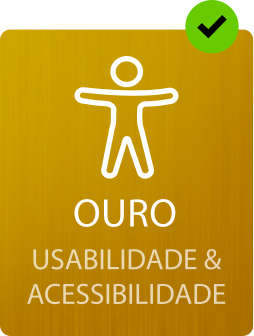

# Selo de Usabilidade e Acessibilidade

## Índice 

- [Introdução](#introdução)
- [Processo de Candidatura](#processo-de-candidatura)
- [Níveis de Classificação](#níveis-de-classificação)
- Requisitos para obter o Selo Bronze 
  - [Usabilidade: conformidade para com a _checklist_ "Conteúdo"](#usabilidade-conformidade-para-com-a-checklist-conteúdo)
  - [Acessibilidade: conformidade 'AA' das WCAG 2.1 de acordo com uma ferramenta automática](#acessibilidade-conformidade-aa-das-wcag-21-de-acordo-com-uma-ferramenta-automática)
- Requisitos para obter o Selo Prata 
  - [Usabilidade: conformidade para com a _checklist_ "Transação"](#usabilidade-conformidade-para-com-a-checklist-transação)
  - [Acessibilidade: conformidade para com a _checklist_ "10 aspetos funcionais"](#acessibilidade-conformidade-para-com-a-checklist-10-aspetos-funcionais)
- Requisitos para obter o Selo Ouro
  - [Testes de Usabilidade](#testes-de-usabilidade)
- [Condições de atribuição e afixação do Selo](#condições-de-atribuição-e-afixação-do-Selo)
- Anexos
  - [Selos em formato SVG](#formato-svg-do-selo-usabilidade-e-acessibilidade)
  - Checklists:
    - [_Checklist_ "10 aspectos funcionais"](checklists/checklist-10aspetos.html)
    - [_Checklist_ "Conteúdo"](checklists/checklist-conteudo.html)
    - [_Checklist_ "Transação"](checklists/checklist-transacao.html)
  - Documentos de recolha de evidências das checklists:
    - [Recolha de evidências da Checklist 10 aspetos funcionais (xlsx, 125KB)](checklists/sintese-10aspetos.xlsx)
    - [Recolha de evidências da Checklist "Conteúdo" (xlsx, 103KB)](checklists/sintese-conteudo.xlsx)
    - [Recolha de evidências da Checklist "Transação" (xlsx, 87KB)](checklists/sintese-transacao.xlsx)
  - Documentos de recolha de evidências das checklists em formato código aberto:
    - [Recolha de evidências da Checklist 10 aspetos funcionais (ods, 56KB)](checklists/sintese-10aspetos.ods)
    - [Recolha de evidências da Checklist "Conteúdo" (ods, 53KB)](checklists/sintese-conteudo.ods)
    - [Recolha de evidências da Checklist "Transação" (ods, 50KB)](checklists/sintese-transacao.ods)
  - Declaração de Acessibilidade e Usabilidade
    - [Gerador da Declaração de Acessibilidade e Usabilidade](https://amagovpt.github.io/gerador/#create)

# Introdução 

O Selo de Usabilidade e Acessibilidade destina-se principalmente às entidades que estão obrigadas ao cumprimento da Lei n.º 36/2011, de 21 de junho, que estabelece a adoção de normas abertas nos sistemas informáticos do Estado, na sequência da qual surgiu o Regulamento Nacional de Interoperabilidade Digital (RNID). O último diploma que alterou a legislação que estabelece o RNID (Lei n.º 36/2011, de 21 de junho e Resolução do Conselho de Ministros n.º 2/2018, de 5 de janeiro) foi o Decreto-Lei n.º 83/2018, de 19 de outubro. Neste diploma, onde se estabelecem os requisitos de acessibilidade dos sítios <em lang="en">Web</em> e das aplicações móveis de organismos públicos, o grupo-alvo do RNID ficou assim definido:

<blockquote>
<p>«Artigo 2.º<br> Âmbito de aplicação</p>
<ol>
<li>A presente lei aplica-se às seguintes entidades:
<ol type="none">
<li>a) Estado;</li>
<li>b) Regiões Autónomas;</li>
<li>c) Institutos públicos;</li>
<li>d) Entidades administrativas independentes;</li>
<li>e) Fundações públicas;</li>
<li>f) Associações públicas;</li>
<li>g) Entidades do setor público empresarial.</li>
</ol>
</li><li>No que se refere à acessibilidade dos sítios <em lang="en">Web</em> e das aplicações móveis, a presente lei aplica-se igualmente às seguintes entidades:
<ol type="none">
<li>a) Autarquias locais;</li>
<li>b) Organizações Não Governamentais que prestam serviços essenciais ao público ou que prestam serviços que visam especificamente responder às necessidades das pessoas com deficiência ou que lhes são diretamente dirigidos;</li>
<li>c) Instituições de ensino superior, estabelecimentos de educação pré-escolar e de educação escolar, públicos e privados com financiamento público, no que se refere ao conteúdo relativo a funções administrativas essenciais por via eletrónica.»</li>
</ol>
</li></ol>
<cite>Redação introduzida na Lei n.º 36/2011 pelo DL n.º 83/2018, de 19 de outubro</cite>
</blockquote>

Como se observa da enumeração anterior, para além do setor público, há um alargamento a alguns setores privados. O cumprimento dos requisitos prescritos pelo Selo de Usabilidade e Acessibilidade é fator de qualidade dos conteúdos e dos serviços disponibilizados em linha pelo que todos os setores estão convidados à sua adoção.

O Selo está estruturado em três níveis, correspondendo a 3 etapas de esforço diferenciadas. Cada uma destas etapas é chancelada por um Selo. O Selo Bronze chancela a conformidade para com os requisitos de nível 1. Ao nível intermédio corresponde o Selo Prata e ao nível mais elevado corresponde o Selo Ouro. Para obter o Selo Ouro, é necessário adicionar aos testes com utilizadores, os requisitos definidos para o Selo Bronze e para o Selo Prata.

O Selo de Usabilidade e Acessibilidade é também ele um instrumento pedagógico. A lista de requisitos não é exaustiva e dela fazem parte aspetos básicos que respondem a preocupações funcionais práticas dos utilizadores. Para o caso das pessoas com deficiências ou incapacidades a seleção dos requisitos levou em conta o princípio básico de "antes de usar é preciso aceder", significando isto que é importante eliminar todo o tipo de barreiras que impedem estes utilizadores - utilizadores de tecnologias de apoio - de aceder aos serviços e à informação disponibilizada na Internet. Só depois de aceder podemos falar de usabilidade.

## Processo de Candidatura

A AMA elaborou os requisitos a observar para a obtenção de cada um dos Selos - Bronze, Prata, Ouro - numa lógica de prática corrente, diária, a usar pelas equipas de desenvolvimento e de edição de conteúdos. As _checklists_ não são para serem usadas apenas no momento da candidatura ao Selo. As listas de requisitos e todo o trabalho efetuado para a sua verificação - ferramentas utilizadas, estudos efetuados, etc. -, à medida que for sendo produzido, deve ser publicado no sítio _Web_ da entidade. 

Uma vez que todas as entidades abrangidas pelo DL n.º 83/2018 estão obrigadas a disponibilizar para cada sítio _Web_ uma página com a Declaração de Acessibilidade e Usabilidade onde se faça referência a todos os esforços levados a efeito para tornar o seu sítio _Web_ mais acessível e mais usável, é nesta página que devem ser sintetizadas todas as evidências e todas as hiperligações para relatórios e estudos que sustentam as mesmas. Para elaborar a página da Declaração de Acessibilidade e Usabilidade, a AMA criou uma ferramenta que permite gerar a Declaração de acordo com os requisitos definidos na legislação. Esta Declaração deve ficar na pasta /acessibilidade do sítio _Web_ (i.e. www.dominio_do_site.pt/acessibilidade).

A Declaração de Acessibilidade e Usabilidade é tudo aquilo que precisa para se candidatar ao Selo. [Preenchida a Declaração de Acessibilidade e Usabilidade](https://amagovpt.github.io/gerador/#create) e publicada no respetivo sítio _Web_, a entidade pode candidatar-se a um dos Selos, enviando à AMA um pedido de candidatura. Do pedido deve apenas fazer parte o endereço onde publicou a Declaração de Acessibilidade e Usabilidade e qual é o Selo a que se candidata: Bronze, Prata ou Ouro. O pedido pode ser feito para o endereço de correio eletrónico: [selo@ama.pt](mailto:selo@ama.pt).

Após confirmar a veracidade das análises apresentadas, a AMA entrará em contacto com a entidade e, em caso afirmativo, disponibilizará o código necessário para a afixação do Selo no respetivo sítio _Web_.

## Níveis de Classificação 

O Selo de Usabilidade e Acessibilidade está estruturado em 3 níveis de classificação, correspondendo a 3 níveis de esforço distintos:

- O nível 1, o mais básico, corresponde ao Selo Bronze; 
- O nível 2  corresponde ao Selo Prata;
- O nível 3, o mais exigente em termos de esforço, corresponde ao Selo Ouro.

### Nível 1 - Selo Bronze

Para a atribuição do Selo Bronze, o sítio _Web_ tem de cumprir com os requisitos constantes da _checklist_ "Conteúdo" e ainda passar a bateria de testes de um validador de acessibilidade _Web_ para o ‘AA’ das WCAG 2.1, de acordo com a metodologia constante no artigo 9.º, n.º 1, alínea a) do DL nº 83/2018, de 19 de outubro.

O nível de cumprimento desses parâmetros durante o primeiro ano deverá ser de 75%. 

### Nível 2 - Selo Prata

Para a atribuição do Selo Prata, cumulativamente ao que é exigido para o nível 1, o sítio _Web_ tem de estar em conformidade para com a _checklist_ "Transação" e da _checklist_ "10 aspetos funcionais".

A _checklist_ "10 aspetos funcionais" é para ser usada de acordo com a metodologia referida no artigo 9.º, n.º 1, alínea b) do DL n.º 83/2018, de 19 de outubro.

O nível de cumprimento desses parâmetros durante o primeiro ano deverá ser de 75%. 

### Nível 3 - Selo Ouro

Para a atribuição do Selo Ouro, cumulativamente ao que é exigido para o nível 2, a entidade tem de efetuar testes com utilizadores ao sítio _Web_. Os testes deverão ser realizados por uma entidade entidade devidamente credenciada.

Este nível está também alinhado com a recomendação constante na metodologia sugerida pelo DL n.º 83/2018 no artigo 9.º, n.º 1, alínea c).

## Requisitos para obter o Selo Bronze

### Usabilidade: conformidade para com a <em lang="en">Checklist</em> "Conteúdo"

- [Consulte a Checklist Conteúdo](checklists/checklist-conteudo).

### Acessibilidade: conformidade 'AA' das <abbr title="Web Content Accessibility Guidelines, version 2.1" lang="en">WCAG 2.1</abbr> de acordo com uma ferramenta automática

O sítio _Web_ tem de passar a bateria de testes de um validador automático de acessibilidade _Web_ para a conformidade ‘AA’ das Diretrizes de Acessibilidade para Conteúdo _Web_ (WCAG 2.1), de acordo com a metodologia constante no artigo 9.º, n.º 1, alínea a) do DL nº 83/2018, de 19 de outubro:

<blockquote>
<ol>
<li>Para os sítios <em>Web</em>, as entidades referidas no artigo 2.º devem adotar os seguintes procedimentos de monitorização:
<ul type="none">
<li>a) Procedimento simplificado automático ou semiautomático, correspondente a uma avaliação automática a uma amostra de páginas do sítio <em>Web</em> composta, no mínimo, pela página de entrada e por todas as páginas hiperligadas à página de entrada e contemplando, sempre que possível, os vários tipos de <em>templates</em> utilizados, recorrendo a um validador automático ou semiautomático de acessibilidade <em>Web</em> comummente utilizado no mercado;</li>
</ul></li>
</ol>
</blockquote>

Apresentam-se a seguir algumas das ferramentas de validação automática que podem ser usadas para proceder à análise da conformidade 'AA' das WCAG 2.1. Fazemos notar que a grande maioria das ferramentas atualmente existentes no mercado têm como referência a versão 2.0 das WCAG, o que é aceitável para a determinação da conformidade.

- AccessMonitor / Observatório Português da Acessibilidade _Web_ (em português)<br>http://accessmonitor.acessibilidade.gov.pt 
- WAVE - _Web_ Accessibility Evaluation Tool<br>http://wave.webaim.org
- Rocket Validator<br>https://rocketvalidator.com
- SiteImprove<br>https://siteimprove.com
- Deque / aXe<br>https://www.deque.com/axe/

##  Requisitos para obter o Selo Prata 

### Usabilidade: conformidade para com a _checklist_ "Transação"

- [Consulte a Checklist "Transação"](checklists/checklist-transacao).

### Acessibilidade: conformidade para com a _checklist_ "10 aspetos funcionais"

A _checklist_ "10 aspetos funcionais" é para ser usada de acordo com a metodologia referida no artigo 9.º, n.º 1, alínea b) do DL n.º 83/2018:

<blockquote>
<ol>
<li>Para os sítios <em>Web</em>, as entidades referidas no artigo 2.º devem adotar os seguintes procedimentos de monitorização:<br>
(...)
<ul type="none">
<li>b) Procedimento simplificado manual, correspondente a uma avaliação manual pericial a uma amostra de páginas que permita responder à diversidade de elementos constantes da lista de verificação para sítios <em>Web</em> publicada no sítio <em>Web</em> www.acessibilidade.gov.pt;</li>
</ul></li>
</ol>
</blockquote>

[Consulte a Checklist "10 aspetos funcionais"](checklists/checklist-10aspetos)

## Requisitos para obter o Selo Ouro

### Testes de Usabilidade

Para obter o Selo Ouro, além dos procedimentos descritos para o Selo Bronze e para o Selo Prata, as entidades deverão apresentar prova da realização de testes com utilizadores.

Este nível está também alinhado com a recomendação constante na metodologia sugerida pelo DL n.º 83/2018 no artigo 9.º, n.º 1, alínea c):

<blockquote>
<ol>
<li>Para os sítios <em>Web</em>, as entidades referidas no artigo 2.º devem adotar os seguintes procedimentos de monitorização:<br>
(...)
<ul type="none">
<li>c) Testes de usabilidade com pessoas com deficiência, dos quais devem fazer parte como objeto de análise, pelo menos, uma tarefa e uma tipologia de utilizadores.</li>
</ul></li>
</ol>
</blockquote>

**1 · NÚMERO DE UTILIZADORES**

Nos testes com utilizadores devem participar, no mínimo, um bloco de 4 utilizadores + 2 utilizadores com necessidades especiais pertencentes a uma das seguintes tipologias: visão, audição, motora, intelectual. :
No mínimo 2 participantes com necessidades especiais por tipologia. Deve ser realizado um bloco de testes por cada 5 ações principais do sítio _Web_ em causa. 

**2 · PROTOCOLO ADEQUADO** 

O teste deve focar-se nas principais funções do sítio _Web_ e ser comum a todos os utilizadores. No caso de utilizadores com necessidades especiais, o protocolo deve ser aplicado no seu local de trabalho/consulta habitual usando as tecnologias de apoio habituais e com as configurações personalizadas pelo próprio participante. 

**3 · PROTOCOLO DE TESTES SEM VIÉS**

O teste procurará não influenciar as opções do utilizador e não deverá fornecer pistas sobre a realização das tarefas, incluindo termos usados. Sempre que apropriado deve ser solicitado aos participantes que verbalizem o que estão a pensar enquanto desempenham a sua tarefa no sítio _Web_.

**4 . Autorizações e registos das sessões**

A entidade deve solicitar autorização por escrito aos participantes e, sempre que apropriado, deve efetuar registos vídeo ou áudio das sessões.

**5 · RELATÓRIO FINAL COM OBSERVAÇÕES E RECOMENDAÇÕES**

O relatório final deve incluir uma lista de observações e recomendações para cada uma das tarefas. 

**6 · INCORPORAÇÃO DE RECOMENDAÇÕES**

As entidades deverão evidenciar que as recomendações foram incorporadas no sítio _Web_. 

## Condições de atribuição e afixação do Selo

### Período de Atribuição 

A atribuição do Selo é válida por um período de 12 meses. Contudo, se se verificar que o sítio _Web_ sofreu uma alteração profunda o Selo será revogado. 

### Método de Aplicação 

Após a atribuição do Selo, pode afixar o mesmo usando o seguinte código HTML:

Se o seu selo é Ouro pode usar o seguinte código:

```html
  <a href="https://selo.usabilidade.gov.pt">
    
  </a>
```

A entidade tem completa liberdade para afixar o Selo de Usabilidade e Acessibilidade em qualquer página ou páginas do sítio _Web_ e nestas selecionar a posição que considerar mais apropriada. A única obrigatoriedade é que o Selo surja, pelo menos, na página de entrada do sítio Web.

### Caducidade do Selo 

As entidades podem renovar o Selo por igual período de 12 meses remetendo à AMA um processo composto de evidências atualizadas à data da renovação. Caso a entidade opte por não renovar o Selo, o mesmo caduca e será solicitado à entidade que retire o código que o afixa no respetivo sítio _Web_.

## Anexos

### Formato SVG do Selo Usabilidade e Acessibilidade 

Todos os selos que se encontram abaixo estão em formato <abbr title="Scalable Vector Graphics" lang="en">SVG</abbr>, o formato vetorial gráfico do <abbr title="World Wide Web Consortium" lang="en">W3C</abbr>. Na prática, é possível escalar qualquer um destes gráficos sem perda de resolução - pode ter um pequeno ícone ou um gráfico do tamanho de um múpi. Para os descarregar, basta selecionar a imagem e com o menu contextual (botão direito do rato) selecionar "guardar como".

Para cada nível existem 4 versões do selo. Pode optar por afixar aquela que melhor se adequa ao seu <em lang="en">design</em>. 

#### Versões do Selo Ouro

<br>
<br>
<br>


#### Versoões do Selo Prata

<br>
<br>
<br>


#### Versões do Selo Bronze

<br>
<br>
<br>

